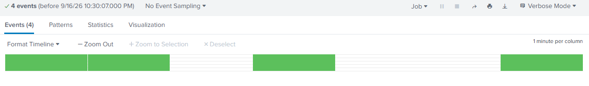

# Attempted Blacklisted Website Access — TryHackMe SOC Simulator

> Platform: TryHackMe SOC Simulator
> Focus: Attempted access to a blacklisted website
> Tools: Splunk, TryHackMe dashboards

## Overview

In this scenario, our firewall blocked access to a malicious website. My job was to look into who attempted to access the website and why they attempted to access the website

## The alert

The alert that I took a look at involved the attempted access of a blacklisted website. Our firewall was able to block access to this website, but it is important to determine who did this and why they did this to prevent future incidents.

## Investigation

The alert flagged access to a blacklisted URL, so I first double-checked that the URL was indeed malicious. Upon confirming that the URL was in fact malicious, I traced the Source IP address to an employee within our company. I then looked up the user on Splunk to see if any suspicious emails had been received. Upon inspection, an email was found from a sender with a suspicious email with a subject line that was trying to convey urgency. Finally, after inspecting the email, the same malicious link could be found in the body.

## Findings

I concluded that the alert was a true positive. The worker was tricked by a phishing email into clicking a suspicious link. 

## Indicators of Compromise (IOCs)

- Sender address: The sender used a fake email representing another company
- Malicious URL/domain: The sender used a lookalike domain
- Social engineering strategies implemented: A sense of urgency was used within this email. 

## Recommended remediation

My recommendation would be to block the sender as well as implement phishing awareness training for employees.  

## What I learned

What I learned from this is that being a SOC analyst is like being a detective. Usually, one log will not tell the whole story, so you have to be able to use all the tools around you to learn about malicious behaviour.

---

*Written as a reflection on my own investigation process using the TryHackMe SOC Simulator. Proprietary scenario content is not reproduced here.*

*Built by Tyler Wood · [github.com/TDub3409](https://github.com/TDub3409) · [LinkedIn](https://www.linkedin.com/in/tyler-wood-301294328/)*
