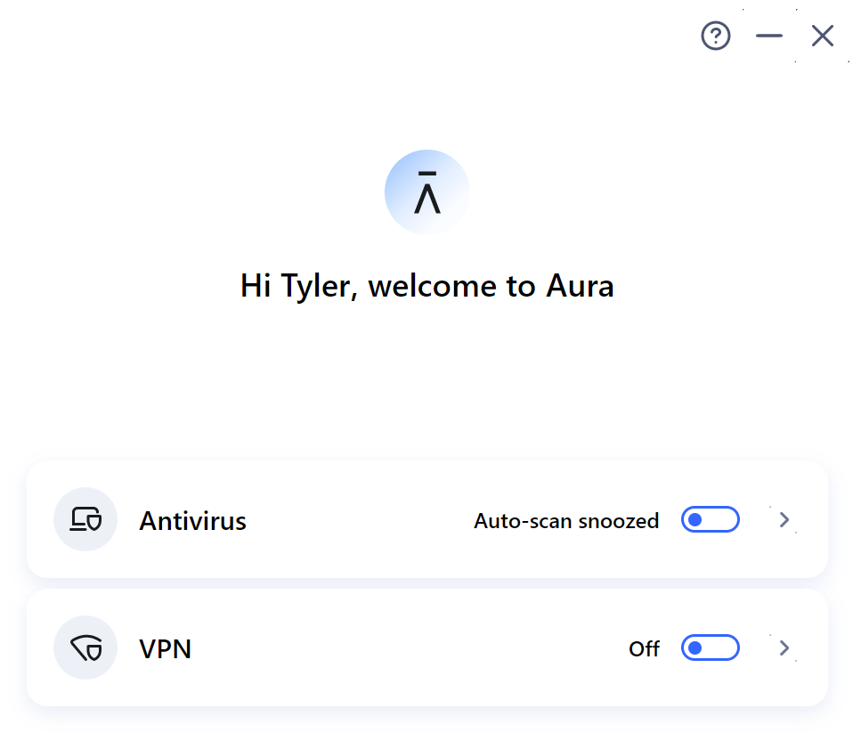
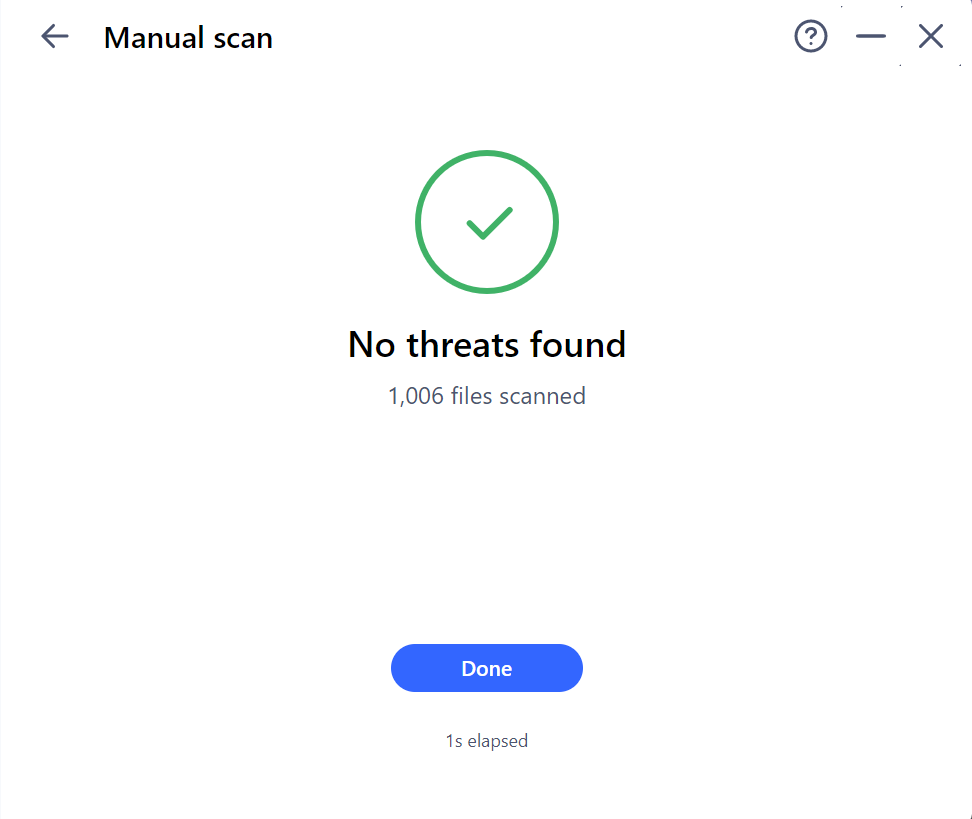
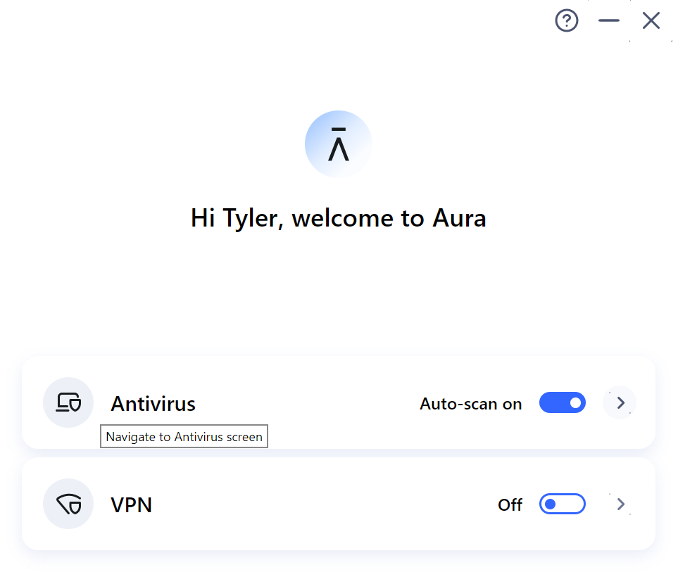
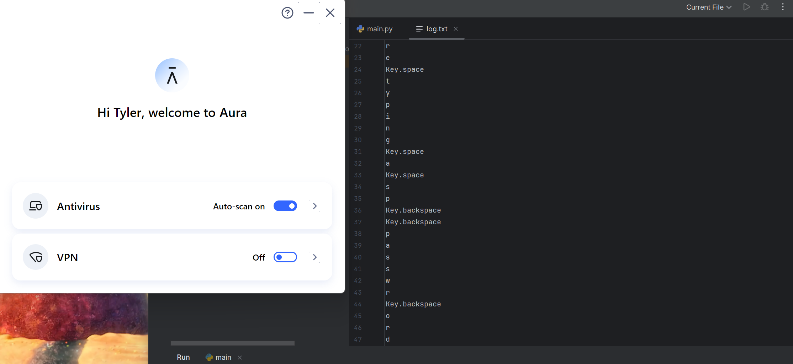

# Endpoint Keylogger Defense Test

> **This is a defensive project.** A basic, controlled keylogger was built in Python and run against my own machine's endpoint protections to evaluate what a real-world security tool would detect, flag, or miss.

## Overview

I wanted to find out whether a basic, self-written keylogger would be caught by the endpoint protection already running on my own machine — both while sitting passively on disk and while directly, deliberately scanned — or whether it would slip past default defenses the way simple, unsigned tools often do in the real world. I ran the same tool through three separate tests to check detection from different angles.

## Environment

| Item | Details |
|------|---------|
| Endpoint protection | Aura Antivirus |
| Tool | Custom Python keylogger (`pynput`) |
| Where it ran | My own machine, in a dedicated test project folder |

## What the tool does

A short Python script using the `pynput` library that captures keystrokes system-wide and writes them to a local text file (`log.txt`). No network transmission, no persistence, no packaging or obfuscation. Just enough to test detection.

## Tests performed

### 1. Auto-scan on vs. off

Compared Aura's real-time auto-scan protection in both states while the keylogger ran and actively wrote to `log.txt`.

**Auto-scan off:**

**Auto-scan on:**

In both states, the keylogger ran uninterrupted and continued writing captured keystrokes to the log file. No alerts, warnings, or blocks from Aura in either case.

### 2. Manual targeted scan — idle

Ran a custom Aura scan directly against the project folder while the keylogger was **not** running (For privacy reasons, I can show the file location).

**Result:** No threats found — 1,006 files scanned.

### 3. Manual targeted scan — while running

Ran the same targeted scan against the same folder while the keylogger was **actively running** and writing to the log file.

**Result:** No threats found — 1,006 files scanned.

## Results

| Test | Result |
|------|--------|
| Auto-scan off, keylogger running | Continued capturing without interruption; no alerts |
| Auto-scan on, keylogger running | Continued capturing without interruption; no alerts |
| Manual scan, idle | 1,006 files scanned; no alerts |
| Manual scan, actively running | 1,006 files scanned; no alerts |

The manual scan result was identical whether the keylogger was idle or actively capturing and writing keystrokes — no difference in outcome between the two states, and no detection in any of the four tests.

## Analysis — why did this happen?

The fact that the scan result didn't change between the idle and running states is itself informative: it suggests Aura's scan engine here is doing **static, signature-based file analysis** rather than **runtime or behavioral monitoring**. A static scan checks whether a file's contents match known malware signatures — it doesn't watch what a process actually *does* while it executes. A custom script built from a common, legitimate library (`pynput`) has no matching signature in that database, so it passed the check regardless of whether it was sitting idle or live-writing keystrokes to disk.

This points to a real limitation of signature-based antivirus: it's built to catch *known* threats, not to evaluate *behavior*. A tool that behaves exactly like malware — capturing input, writing it to disk — can still pass a scan cleanly if nothing about its file signature has been seen before. Catching this kind of tool would require **behavioral detection**: watching for the pattern (a process hooking keyboard input and writing to a file), not matching a signature.

There are two primary reasons that I believe the keylogger was not flagged on Aura. The primary way I believe Aura looks at the file is for a signature that is within its database to determine whether or not to block a file/files, not behaviours on a system. This would mean that my code would not catch Aura off guard because my keylogger was very basic and handmade with a legitimate library ('pynput'), meaning there is no signature for Aura to catch. The second reason that I believe the keylogger was not detected is that the log.txt file was not being transmitted off my network, and it was not in a suspicious location. A keylogger can be found in suspicious downloaded software as well as advanced ones being located within the kernel. My keylogger was just sitting in my PyCharm project. 

 This brings up concerns with how antiviruses work. For the average person, this tool will work just fine enough, but if you have sensitive information, it's important to implement layered security measures to ensure something does not slip through the cracks. 
 
## What I'd add next

- Instrument the host with Sysmon and forward logs to a SIEM (Splunk) to see what telemetry exists even when antivirus stays silent
- Test the same tool against a second AV product to compare detection approaches

## What I learned

What this taught me is that I should not feel safe just because I have an antivirus running on my pc. If I were to download software that does not have a signature with Aura, I could put my own personal data at risk. It's important that I keep a proactive mindset when it comes to my own security and any business I may work for in the future. Threat actors are aware of these signatures and will always come up with new modified tools to attack with, so it's important to have layered security and not rely on one tool. 

---

*Built by Tyler Wood · [github.com/TDub3409](https://github.com/TDub3409) · [LinkedIn](https://www.linkedin.com/in/tyler-wood-301294328/)*
