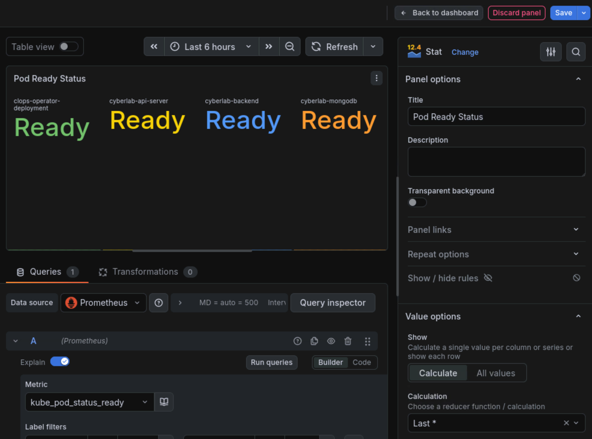
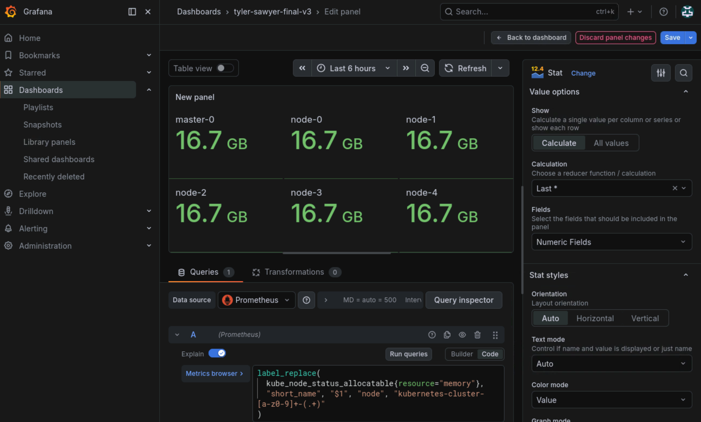

# Kubernetes Cluster Monitoring — Grafana + Prometheus

> Real-time observability dashboards for a live multi-node Kubernetes cluster, built with Grafana and Prometheus to surface pod health, node capacity, and abnormal behavior at a glance.


<!--
  HOW TO USE THIS TEMPLATE
  - Replace anything in [BRACKETS] with your own words.
  - (SCREENSHOT: ...) marks where to drop an image. Put images in an
    /images folder and reference them like: 
  - You already HAVE the three screenshots for this — they go where marked.
  - Delete these comment blocks before publishing.
  - Only claim the adoption line if your professor confirms it's still in use.
-->

## Overview

This project delivers a real-time monitoring solution for a live, multi-node
Kubernetes cluster. Using Prometheus as the metrics data source and Grafana for
visualization, the dashboards track pod readiness, service availability, and
per-node resource consumption so that operational problems — a pod failing to
become ready, a node running low on disk — are visible immediately rather than
discovered after something breaks.

I led the project, deciding what the team would monitor and why, and dividing
the build work between myself and a partner. It began as a
Database Design & Implementation course project and grew into a full
infrastructure-observability build on real cluster infrastructure.


The dashboard was subsequently adopted by the university for ongoing
monitoring of the cluster. 

## Environment

| Component | Details |
|-----------|---------|
| Orchestration | Kubernetes (6-node cluster: 1 control-plane + 5 workers) |
| Metrics source | Prometheus |
| Visualization | Grafana |
| Query language | PromQL |
| Context | Database Design & Implementation course project; live cluster |

## What the dashboards show

### 1. Pod Ready Status

At-a-glance readiness for the core cluster services — `clops-operator-deployment`,
`cyberlab-api-server`, `cyberlab-backend`, and `cyberlab-mongodb` — each showing
a clear Ready / Not Ready state. Built on the `kube_pod_status_ready` metric so a
pod that fails to reach a ready state is immediately obvious.



### 2. Running Pods

A companion view showing live Online / Offline status for each service, giving a
fast health read across the deployment without digging into `kubectl`.

<!-- (SCREENSHOT: this is the "Running Pods" panel from your dashboard view) -->

### 3. Node Disk & Memory Usage

Per-node resource tracking across the control-plane node and all five workers
(`master-0`, `node-0` … `node-4`), covering disk consumption and allocatable
memory. This is what catches a node trending toward exhaustion before it takes
workloads down with it.



## A design decision worth calling out

The raw Kubernetes node names returned by Prometheus are long and hard to read on
a dashboard (e.g. `kubernetes-cluster-[id]-node-0`). Rather than accept the noisy
default labels, I used PromQL's `label_replace` to extract a short, readable name
for each node:

```promql
label_replace(
  kube_node_status_allocatable{resource="memory"},
  "short_name", "$1", "node", "kubernetes-cluster-[a-z0-9]+-(.+)"
)
```

This is a small thing, but it's the difference between dropping in a pre-built
dashboard and actually building one: the panels read cleanly because the query
was written to reshape the data for the human looking at it.

## What I set out to monitor, and why


Our team's overall goal was to monitor general pod and node health. Our dashboards
were used to monitor the deployment of our school's pods as well as their functionality
after deployment. 


## What I'd add next

- Alerting rules so the dashboard pages someone instead of waiting to be watched
- Pod restart-frequency tracking to catch crash-looping workloads
- Historical retention for trend analysis rather than only live state

## Repo Contents

```


*Built by Tyler Wood · [github link] · [linkedin link]*
